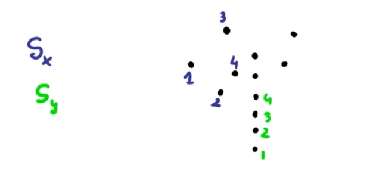
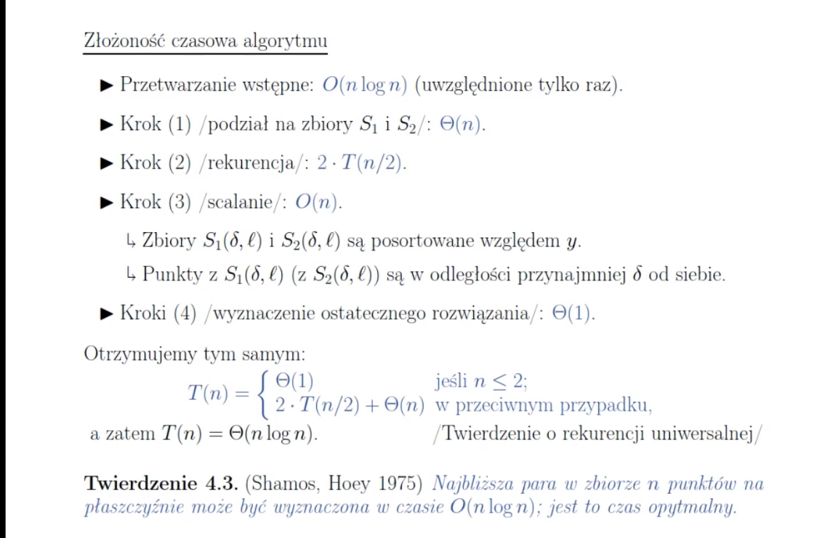
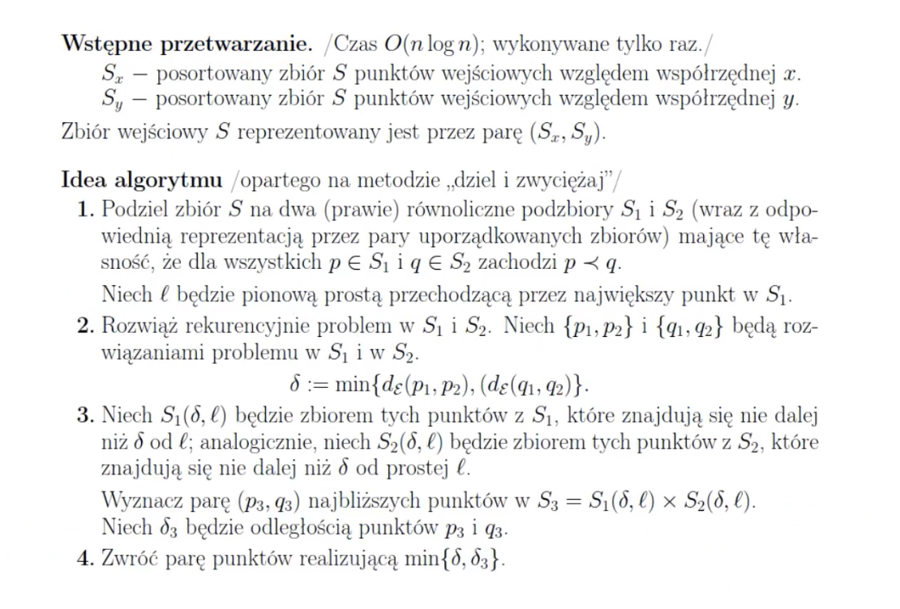
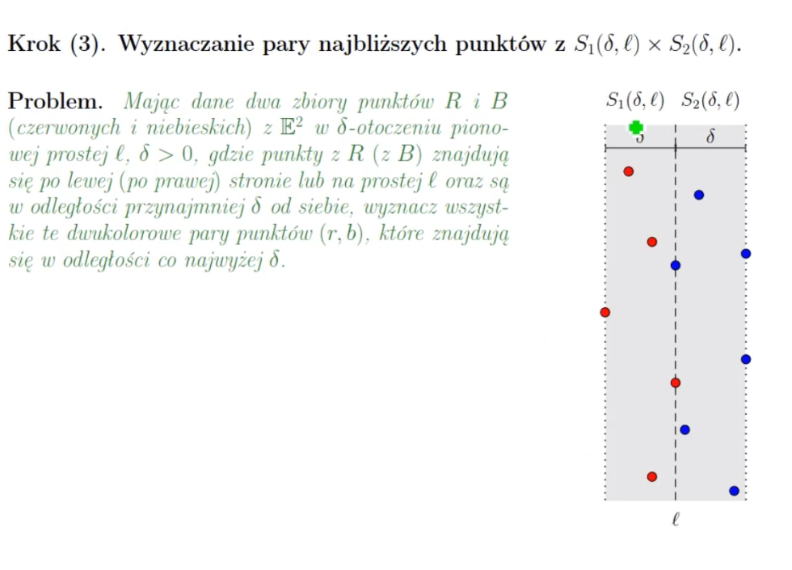

Problem pary najbliższych punktów na płaszczyźnie, gdzie wejście to zbiór punktów na płaszczyźnie, a wyjście to para najbliższych punktów

# Algorytm
1. Wstępne przetwarzanie O(nlogn) 👍
   - tworzymy zbiór Sx, posortowany zbiór S punktów wejściowych względnej współrzędnej x 👍
   - tworzymy zbiór Sy, posortowany zbiór S punktów wejściowych względnej współrzędnej y 👍

2. Podziel Sx i Sy na SxLeft, SyLeft, SxRight, SyRight  

3. Znajdz najmniejszy dystans poimędzy punktami dla zbiorów Sx i Sy używając algorytmu Dziel i Zwyciężaj
   
## Notes
1.  

https://www.google.com/search?q=closest+pair+of+points+divide+and+conquer+github&sxsrf=AOaemvKrftKUt7ZRX3YqG6uSFgxvc9JiTQ:1636019224588&source=lnms&sa=X&ved=2ahUKEwjykejFtv7zAhXN6eAKHeOZASIQ_AUoAHoECAEQAg&biw=1080&bih=1777&dpr=1
