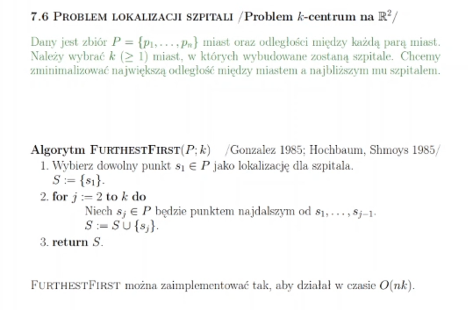
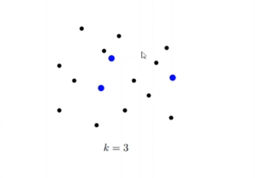

# Problem Lokalizacji Szpitali (Problem k-centrum na R^2)
- mamy zbiór miast (punkty)
- chcemy wybrac k punktów w którym umieścimy szpital
- należy tam rozmieścić szpitale, aby zminimalizować odległość dla każdego miasta do najbliższego szpitala
- dla tego algorytmu w najgorszym przypadku (współczynnik aproksymacyjny = 2) otrzymamy rozwiązanie 2x gorsze, niż gdybyśmy
robili algorytm dokładny

# Złożoność dla Algorytmu
O(nk) gdzie k to liczba szpitali

# Działanie algorytmu
- zaczynamy od dowolnego punktu
- mówimy, że w tym mieście zakładamy szpital
- potem od 2 do k (pozostałe szpitala) szukamy, znajdujemy takie miasto ktore jest najbardziej odlegle od wszystkich wybranych szpitali
- w tym miescie stawiamy szpital, dolaczamy do zbioru szpitali i zwracamy 
