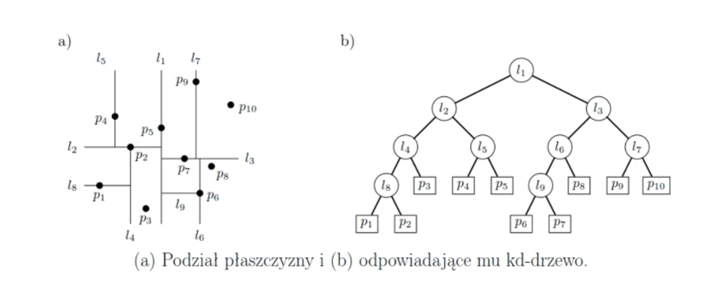

Zapytania w przestrzeni dwuwymiarowej: KD-Drzewa

Problem: (Przesukiwanie obszarów ortogonalnych)

Niech S będzie danym zbiorem punktów na płaszczyźnie rzeczywistej R^2.

Wejście: Obszar zapytania R = [x1, x2] x [y1, y2] 
- zbiór punktów na płaszczyźnie (prostokąt)
Wyjście: Wszystkie punkty z S, które należą do R.

Algorytym:
- program dwuczęściowy 
  - budowanie drzewa (ona dostaje zbiór punktów, tworzy drzewo)
  - mając drzewo i obszar, szuka w drzewie które punkty z drzewa do niego należą

- dla parzystej liczby punktów robimy prostą pionową, nieparzyste prosta pozioma
- najprosciej jest zapamietac proste (pionową/poziomą), drzewo sie jakos rozejdzie
- dla pionowych przechowywac x'a, dla poziomych y'a
- jak zejdziemy do liści

- prostszy sposób: metoda top-down.. Mamy obszar w ktorym są te wierzcholki
    - w korzeniu przevhowujemy wspolrzedne duzego prostokata 
    - w nastpenych kroku zielone obszary
    - mozna przechowywac wspolrzedne tych prostokatow

- jeszcze inny sposob:
  - bottom-top: mamy punkty i budujemy drzewo od dołu
  - zamiast przechowywac duze prostokaty, w lisciach przechowujemy konkretne wspolrzedne tych puntkow
  - nie brac calych frag obszaru, tylko obszar wyzn przez te dwa punkty

- punkty dzielimy raz po x, raz po y
- otrzymujemy drzewo. W kazdym z wezlow jest jakis obszar zapytania.
