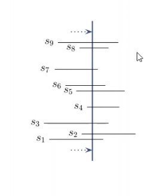
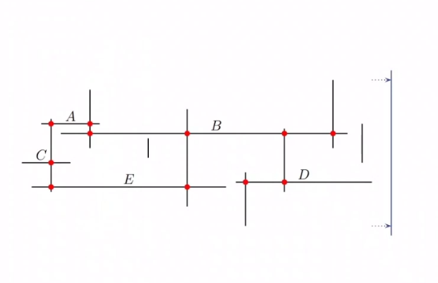
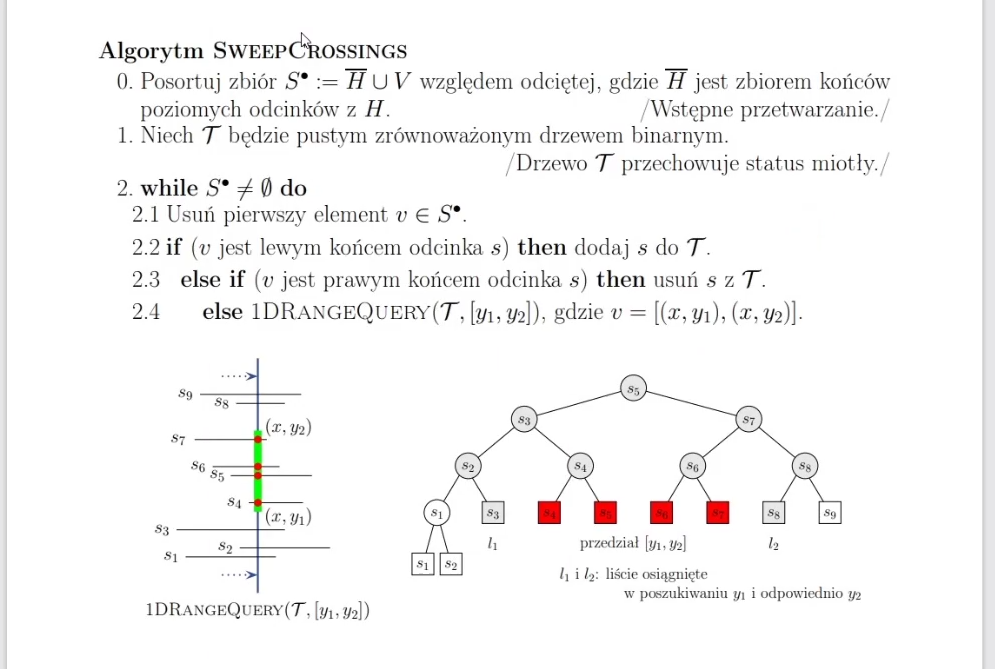
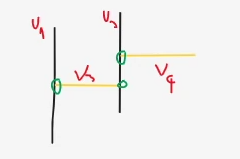
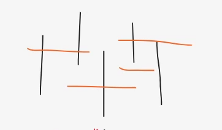

# Punkty przecięć

Mamy odcinki poziome, pionowe i mamy zwrócić wszystkie punkty przecięcia takiego zbioru 

Wejście: H - punkty poziome, V - punkty pionowe
Wyjście: Punkty przecięć

Przechodzimy albo końce odcinków poziomych, albo odcinki pionowe

Posortować:
lewy koniec odcinka poziomego (z = 1)
odcinek pionowy (z = 2)
prawy koniec odcinka poziomego (z = 3)

A potem dopiero posortować po zmiennej x (stabilnie)

Trudny przypadek:

Idać miotłą:
lewy v3
v1, zwracamy koniec v3
odwiedzamy v4, dodajemy do drzewa
odwiedzamy v2, spradzamy drzewo i zwaracamy 2 zaznaczone punkty
usuwamy v3 z drzewa

Sortowanie pozwala uniknąć problemu, gdzie końce odcinków poziomych mogą mieć taką samą
współrzędną x jak odcinki pionowe

Trzeba sprawdzać zakres y:

# Implementation based on:
https://cw.fel.cvut.cz/b181/_media/courses/cg/lectures/03-rangesearch.pdf
http://www.facweb.iitkgp.ac.in/~sourav/Lecture-17.pdf
https://github.com/Shalin23/Range-Tree/blob/main/RangeTree.py
http://people.scs.carleton.ca/~michiel/lecturenotes/ALGGEOM/horverintersect.pdf
http://www-di.inf.puc-rio.br/~laber/range_kd_trees.pdf
https://github.com/pavle10/faculty_projects/blob/e6d9063538608bfd824013b3085ef85fb767b799/les/src/les/RangeTree.java
