Jądro wielokąta prostego to taki obszar, że z dowolnego punktu w jądrze będziemy  
mogli dostać się do dowolnego punktu wielokąta za pomocą prostej monotonicznej  

Jeżeli największe maksimum jest większe od najniższego minimum, to jądro nie będzie istnieć
Jeśli będą istniały minima i maksima lokalne, to dolna i górna krawędź jądra będą poziome.
Jeśli nie będą istniały, to jądro będzie całością i to może być dowolny kształt.
Na brzegach jądra mogą być dzikie rzeczy.

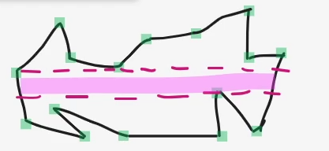

Wejście: zbiór wierzchołków, kierunek przeciwny do wskazówek zegara, współrzędne liczby całkowite
Wyjście: jądro (4 pkt), obwód jądra (1pkt)
Złożoność liniowa - O(n)

# TODO
- walidacja, czy w wielokąt jest prawidłowy?
- czy istnieje jądro?
      - jeśli tak, to jaki obwód?
- jak wyznaczyć minimum lokalne?

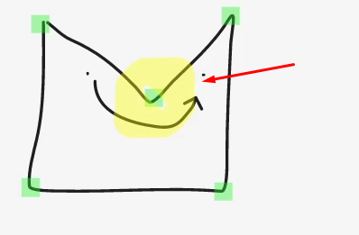

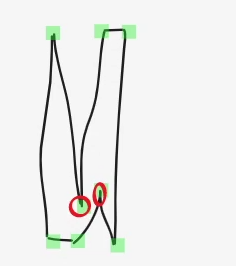

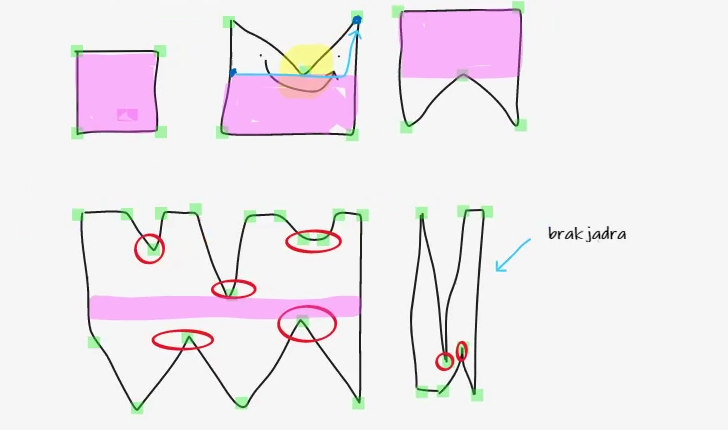
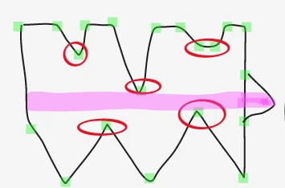
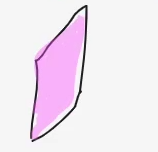

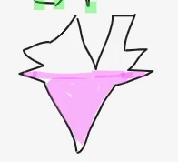 // brak maksimum lokalnego, ma tylko minima?

# Algorytym
- przechodzimy wielokąt po kolei
- szukamy, które wierzchołki to są minima i maksima - one wyznaczają nam górną i dolną granicę jądra
- jeśli góra będzie większa od dołu, to będziemy mieli jądro
- obwód (38.25)

# Algorytm
- może się zdarzyć, że jądra nie będzie
- min lokalne - niższy, lub równy swoim sąsiadom przy odpowiednim skręcie
1) znaleźć minimum punktu w wielokącie  y_min
2) znaleźć minimum punktu w wielokącie y_max
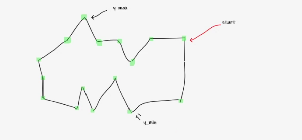
3) wyznacz min lokalne i znajdz najmniejsze z nich, i porównaj lokalne z y_min (wybieramy mniejsze)
(jezeli jest wiecej, niz 1 to bedzie trzeba o tym pamietac przy liczeniu obwodu)
- znajdz taką trójkę wierzchołków, gdzie środkowy punkt ma mniejszą lub równą współrzędną y
i dodatkowo szukamy skrętów w prawo (55:48)
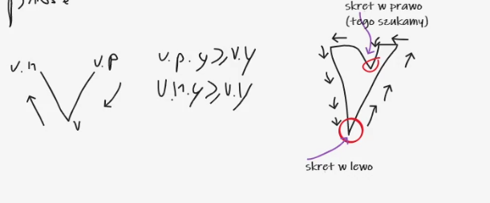
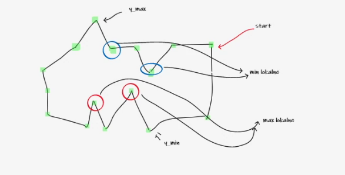
4) wyznacz max lokalne i znajdz najwieksze z nich i porównaj z y_max (wybieramy wieksze)
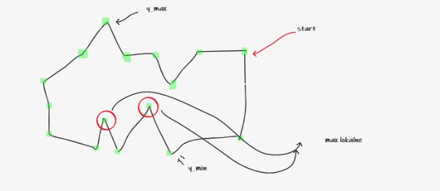
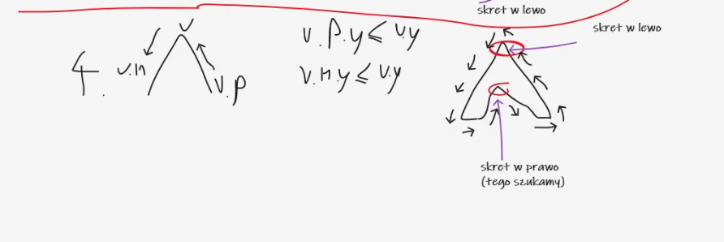

5) wyznaczamy na najniższym minimum granicę naszego jądra
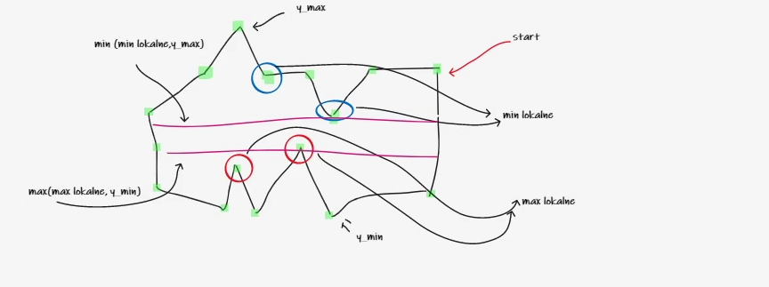
y_min > y_max jest jądro  
y_min < y_max nie ma jądra
jeśli jakiekolwiek min lokalne istnieje, to na pewno będzie mniejsze niż y max 
(ale inaczej jak nie ma lokalnych minimow)

 
