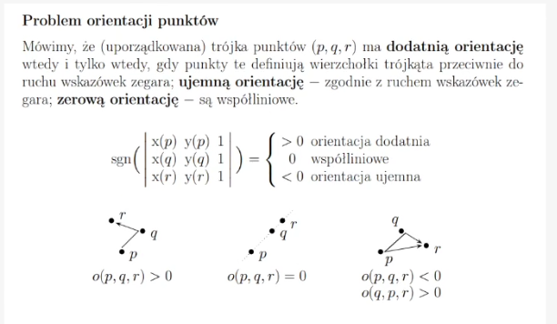
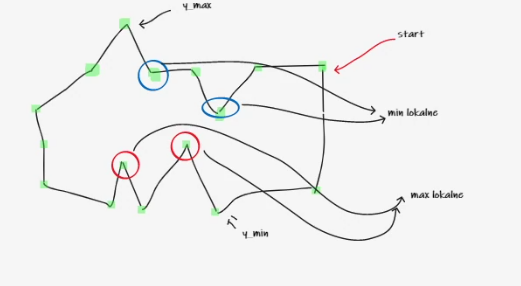

# Jądro wielokąta

# Opis
Jądro wielokąta prostego to taki obszar, że z dowolnego punktu w jądrze będziemy  
mogli dostać się do dowolnego punktu wielokąta za pomocą prostej monotonicznej

Jeżeli największe maksimum jest większe od najniższego minimum, to jądro nie będzie istnieć
Jeśli będą istniały minima i maksima lokalne, to dolna i górna krawędź jądra będą poziome.
Jeśli nie będą istniały, to jądro będzie całością i to może być dowolny kształt.
Na brzegach jądra mogą być dzikie rzeczy.

- min lokalne - niższy, lub równy swoim sąsiadom przy odpowiednim skręcie
- szukamy, które wierzchołki to są minima i maksima - one wyznaczają nam górną i dolną granicę jądra
- jeśli góra będzie większa od dołu, to będziemy mieli jądro
- obwód

# Algorytm
Wejście: zbiór wierzchołków, kierunek przeciwny do wskazówek zegara, współrzędne liczby całkowite
Wyjście: jądro (4 pkt), obwód jądra (1pkt)
Złożoność liniowa - O(n)

1) przechodzimy wielokąt po kolei 👍
2) znaleźć minimum punktu w wielokącie  y_min 👍
3) znaleźć minimum punktu w wielokącie y_max 👍
4) wylicz orientację puntków 👍
5) wyznacz min lokalne 👍
6) wyznacz min lokalne i znajdz najmniejsze z nich, i porównaj lokalne z y_min (wybieramy mniejsze) 
(jezeli jest wiecej, niz 1 to bedzie trzeba o tym pamietac przy liczeniu obwodu)  👍
znajdz taką trójkę wierzchołków, gdzie środkowy punkt ma mniejszą lub równą współrzędną y
i dodatkowo szukamy skrętów w prawo  👍
6) wyznacz max lokalne i znajdz najwieksze z nich i porównaj z y_max (wybieramy wieksze) 👍
7) wyznaczamy na najniższym minimum granicę naszego jądra 👍
y_min > y_max jest jądro 👍
y_min < y_max nie ma jądra 👍
jeśli jakiekolwiek min lokalne istnieje, to na pewno będzie mniejsze niż y max 
(ale inaczej jak nie ma lokalnych minimow)  👍
8) czy istnieje jądro? jeśli tak, to jaki obwód? 
10) walidacja, czy w wielokąt jest prawidłowy? 👍
11) może się zdarzyć, że jądra nie będzie 👍

  
  

 // brak maksimum lokalnego, ma tylko minima?

